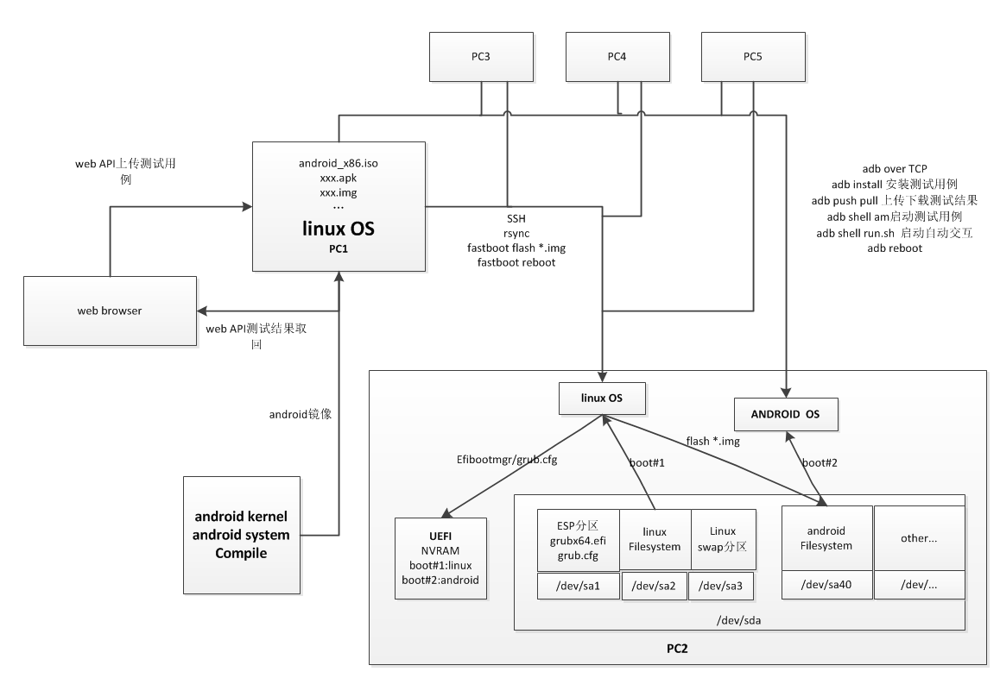

# openthos在bare-metal上的自动测试
##使用前必看
一定要注意的事项！！！被测试的机器一定要以UEFI形式和GPT磁盘格式安装ubuntu 15.10版本以上的64位操作系统，安装系统时选择手动分区，不要把磁盘空间全部占满了，需要留30到40g的空余空间。否则后面的工作无法进行！！！
所有电脑上的ubuntu系统新安装完毕以后root账户的密码没有设定，请在当前账户下面执行 

sudo su【回车】#切换到root账户 

passwd【回车】#修改root账户的密码 

注：sudo passwd root【回车】也可以修改root账户的密码【相关知识请百度搜索学习，这里就不详细描述了】

vim /etc/hostname 修改各个机器中ubuntu系统的hostname为不同的名字，不要出现重复的hostname。

然后下面的所有在ubuntu上面的操作都请在root账户下面操作，以免出现权限不足的麻烦。
##测试对象，以及设计原理说明
* PC2  
* PC2为测试对象,上面安装了linux和android_x86双系统  
   linux系统的作用跟android手机的fastboot功能是一样的，用来刷系统，或者更新系统中的一个分区。

 PC2上面的linuxOS安装到了/dev/sda2,android安装到了/dev/sda40【可以通过配置文件指定】,ESP分区为/dev/sda1,测试程序中的参数也是这么设定的(见原理图)。如果想变换分区，需要修改*.sh中对应的参数，程序注释中也给出了提示。   
* PC1  
* PC1为是存放程序和数据的地方，用于远程控制PC2,PC3，PC4...  
而且可以通过修改autoN.sh配置文件中的以下两个参数达到控制多台设备的效果。不同的设备对应不同的IP地址。  
ip_linux="192.168.2.16"【PCN的IP地址】  
ip_android="192.168.2.58"【PCN上面的android IP地址】  

* 特点：
 1. 【fastboot for androidx86】模拟了android 中的fastboot功能，参数也很相似，通用于测试android手机设备。  
 2. 【kickstart for androidx86】利用kickstart的无人值守安装机制，结合【fastboot for androidx86】实现了androidx86在baremetal下面的无人值守安装。
 2. 使用rsync可以方便的同步脚本和数据，而且是增量的，而且可执行权限也不需要加，由于是镜像的，所以排错很容易。本地测试远程测试都很方便 
 3. 一份代码，只需要修改配置文件，即可同时应用于远程控制多台设备。  

* 工作原理图  

##PC1初始化环境
以root 登录，执行以下命令  
ssh-keygen  
生成公钥私钥对，供后续ssh公钥登录使用。

##PC2初始化环境

1.  对于机箱前面板上有SD读卡器的台式机，需要打开机箱，从主板上拔掉SD卡读卡器的USB线，否则会造成grub中硬盘编号为hd1，使得androidx86引导失败  
2.  安装64位ubuntu（要求15.10及以上，因为14.04以前的版本中fdisk不支持操作gpt格式的磁盘）  
首先要在UEFI中关闭cms选项，即把传统的BIOS功能关掉，只使用uefi模式 
同方笔记本的设置方法：
开机根据提示按F2进入BIOS设置，选择anvanced,然后将OS support设置为UEFI OS 然后保存退出，重启即可。  
同方的台式机设置方法:  
H170主板：  
开机根据提示按DEL进行BISO设置，选择advanced mode然后选择启动，再选择csm(兼容性支持模块），再选择开启CMS中的值为关闭。  
然后save changes & reset。  
其他型号的主板：  
开机根据提示按DEL进入BIOS设置，选择BOOT,选择luanch csm，并且设置其值为disabled.  
然后save changes & reset。  

  
硬盘分区必须是gpt格式  
以UEFI形式安装ubuntu到/dev/sda2  
esp分区为/dev/sda1  
程序会根据配置参数自动创建10G的分区，用于安装androidx86  

3.
apt-get install squashfs-tools【安装 squashfs-tools】    
apt-get install openssh-server  

4.修改ssh root登录 
vi /etc/ssh/sshd_config  
修改其中的  
PermitRootLogin without-password  
或者  
PermitRootLogin prohibit-password  
为  
PermitRootLogin yes  

然后执行  
service ssh restart  
5. 把PC2启动到linux，等待接收PC1的测试指令
6. PC3,4,5初始化方法同PC2

##PC2的自动化测试【在PC1上操作】
1.  在ubuntu部署ssh无密码登录  
以root 登录，执行以下命令  
ssh-copy-id -i ~/.ssh/id_rsa.pub 192.168.200.10[pc2的ip地址]  

1.  将git中bare_metal_autotest下面的android_auto/目录复制到PC1上的任意目录下面
例如/root/android_auto_2
并且修改/root/android_auto_2/中的auto2.sh中的配置文件为PC2的配置情况
ip_linux="192.168.2.16"【PC2的IP地址】  
ip_android="192.168.2.58"【PC2上面的android IP地址】  
android_iso_for_test="/root/android_x86.iso_xly_5.1"【要测试的androidx86  ISO的全路径及文件名】  
diskpart_for_android="/dev/sda40"【PC2上面的要安装android的目标分区】  

2. 提供要测试的ISO文件到android_iso_for_test参数指定的位置
3. 进入/root/android_auto_2
运行./auto2.sh

##PC3的自动化测试【在PC1上操作】
1.  在ubuntu部署ssh无密码登录  
以root 登录，执行以下命令  
ssh-copy-id -i ~/.ssh/id_rsa.pub 192.168.200.10[pc3的ip地址]  

1.  将git中bare_metal_autotest下面的android_auto/目录复制到PC1上的任意目录下面
例如/root/android_auto_3
并且修改/root/android_auto_3/中的auto3.sh中的配置文件为PC3的配置情况
ip_linux="192.168.2.17"【PC3的IP地址】  
ip_android="192.168.2.59"【PC3上面的android IP地址】  
android_iso_for_test="/root/android_x86.iso_xly_5.1"【要测试的androidx86  ISO的全路径及文件名】  
diskpart_for_android="/dev/sda40"【PC3上面的要安装android的目标分区】
2. 提供要测试的ISO文件到android_iso_for_test参数指定的位置
进入/root/android_auto_3
运行./auto3.sh

##PCN(N>=2)的自动化测试【在PC1上操作】
1.  在ubuntu部署ssh无密码登录  
以root 登录，执行以下命令  
ssh-copy-id -i ~/.ssh/id_rsa.pub 192.168.200.10[pcN的ip地址]  

1.  将git中bare_metal_autotest下面的android_auto/目录复制到PC1上的任意目录下面
例如/root/android_auto_N
并且修改/root/android_auto_N/中的autoN.sh中的配置文件为PCN的配置情况
ip_linux="192.168.2.17"【PCn的IP地址】  
ip_android="192.168.2.59"【PCN上面的android IP地址】  
android_iso_for_test="/root/android_x86.iso_xly_5.1"【要测试的androidx86  ISO的全路径及文件名】  
diskpart_for_android="/dev/sda40"【PCN上面的要安装android的目标分区】
2. 提供要测试的ISO文件到android_iso_for_test参数指定的位置
进入/root/android_auto_N
运行./autoN.sh

##说明 
4.  autoN.sh是一个测试过程的举例，
演示了本目录中的各个脚本提供的服务如何使用。以及如何使用这些服务完成一个系统安装，app运行测试。
例如重装android系统,启动到android，安装一个apk,启动apk,测试用例自己记录测试中间结果到约定目录，重启android,测试完毕。
5.  本测试框架只提供机制不提供策略，如果要加新的测试过程，只需要仿照auto2.sh脚本进行修改即可。

##测试结果展示
cd  lkp_result_web 

./creat_symbol.sh ###这个脚本一定要执行，尤其是给html目录增加权限，必须进行。

在浏览器输入http://localhost/result.php查看结果
##BUG REPORT
如有bug欢迎反馈，讨论、交流。

